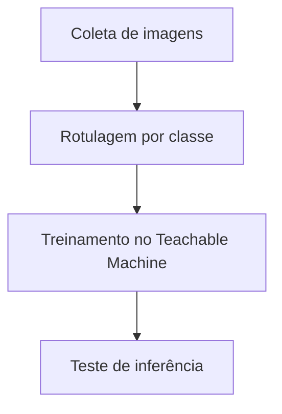

# Projeto SM2 - Laboratório de Classificação Visual

## 📝 Descrição do Projeto
Implementei um laboratório de classificação visual com **Teachable Machine** para entender o ciclo de treinamento, validação e inferência de um classificador supervisionado.

O objetivo foi avaliar como a qualidade do dataset e o equilíbrio das classes afetam precisão e generalização.

## 🧰 Tecnologias Utilizadas

- **Plataforma:** Teachable Machine
- **Abordagem:** classificação de imagem por classes
- **Saída:** modelo treinado e testes de inferência

## 📊 Resultados e Aprendizados
- **Pipeline completo executado:** coleta, treino, validação e testes.
- **Decisão técnica:** balancear amostras por classe para reduzir viés de predição.
- **Aprendizado:** pequenas variações no dataset impactam diretamente a estabilidade das previsões.

## 🖼️ Evidência Visual

*Figura 1: Fluxo de classificação visual aplicado no SM2.*

## ▶️ Como Executar
### Pré-requisitos
- Navegador atualizado
- Conta Google (opcional para salvar projeto)

### Passos
1. Acesse o laboratório: <https://teachablemachine.withgoogle.com/models/dOSbmmhTs/>
2. Teste o modelo com imagens de entrada.
3. Compare as probabilidades de saída por classe.

### Troubleshooting
- Se o modelo não carregar, limpe cache do navegador e reabra o link.

---
<a href="https://github.com/Gabriel-Assis-Silva/portfolio-gabriel-de-assis-silva">Voltar ao início</a>
